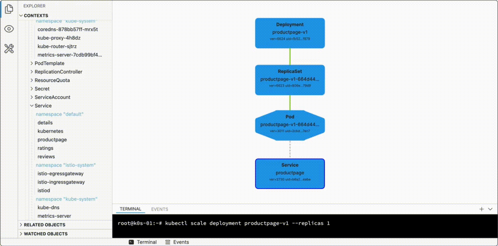
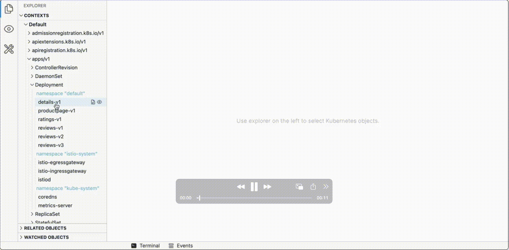
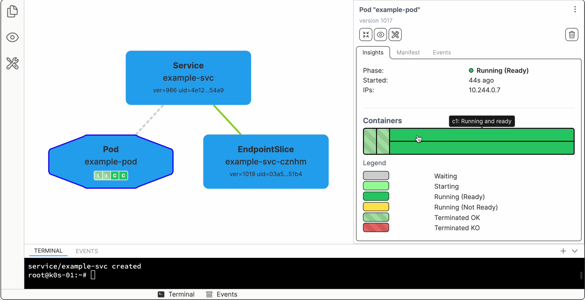

# k'exp - Kubernetes Explorer

Understand Kubernetes - the visual way.
Not yet another attempt to manage production clusters in the browser.

k'exp is for:

- Learning and exploring Kubernetes capabilities
- Application development (object graph _presets_ for every app)
- Controller and operator development (dynamic object graphs)
- [coming soon] Postman-like client and request builder for Kubernetes API

k'exp can reflect the state of your cluster in real-time:



k'exp can also give you a quick overview of "related" objects:



...as well as show object-specific insights:



## In the wild

You can try k'exp at every [Kubernetes Playground](https://labs.iximiuz.com/playgrounds?category=kubernetes) on iximiuz Labs.
Some tutorials also use k'exp to visualize Kubernetes objects and their relationships:

- [Making Sense Out of Native Sidecar Containers in Kubernetes](https://labs.iximiuz.com/tutorials/kubernetes-native-sidecars)

You can also find [a few short demos on YouTube](https://www.youtube.com/playlist?list=PL3ea3TG5uHXhzzk9gK4oNQk14lYyxdxPx).


## Installation

Grab the latest release from GitHub:

```sh
GOOS=linux
GOARCH=amd64

curl -Ls https://github.com/iximiuz/kexp/releases/latest/download/kexp_${GOOS}_${GOARCH}.tar.gz | tar xvz

sudo mv kexp /usr/local/bin
```

At the moment, the only system `kexp` is actively tested on is Linux amd64,
but builds for Darwin amd64/arm64 and Linux arm64 are also available.


## Usage

It's a statically linked Go binary with an embedded UI.
If you already have `kubectl` configured to access your cluster(s),
you can run `kexp` too - it uses the same `KUBECONFIG` discovery logic.

By default, `kexp` starts a server on `localhost:5173`:

```sh
kexp

open localhost:5173
```

Alternatively, you can specify a custom address:

```sh
kexp --host 0.0.0.0 --port 8090
```


## How it works

`kexp` is a daemon that uses the local `KUBECONFIG` to access Kubernetes API.
Thus, it's as powerful (and potentially **destructive!**) as your `kubectl` can get.
The daemon lists Kubernetes API resources and objects,
may start a bunch of watchers for the objects of interest,
and even delete objects if you ask it to (via the UI).
The UI is a single-page application written in TypeScript and Vue and embedded into the daemon binary.


## Development

Pre-requisites:

```sh
go install github.com/golangci/golangci-lint/cmd/golangci-lint@latest

cd ui
npm install

# Optional
kind create cluster
# ...or
minikube start
```

Running the dev server and the UI is easy:

```sh
# In terminal 1
make back-run-dev

# In terminal 2
make front-run-dev
```

After that, you can access the UI at `http://localhost:5173`.


## Contributing

Contributions are welcome!
